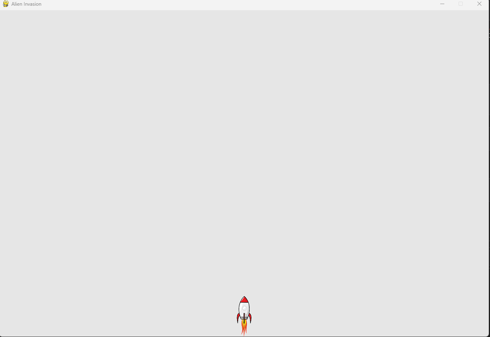

# 2022-10-23
## Starting the Alien Invasion Project

So far, I have set up a learning journal, have a github repository, and have installed pygame (although this was through pip... I"m not sure if this will cause problems later).

I am also somewhat forced to use VS code since spyder seems to freeze up.

The plan for this project is:
```
In Alien Invasion, the player controls a rocket ship that appears at the bottom center of the screen. The player can move the ship right and left using the arrow keys and shoot bullets using the spacebar. When the game begins, a fleet of aliens fills the skey and moves across and down teh screen, The player shoots and destroys the aliens.  If the player shoots all the aliens, a new fleet appears that moves faster than the previous fleet. If any alien hits the player's ship or reaches the bottom of the screen, the player loses a ship. If the player loses three ships, the game ends.
```

I've thus far simply copied the code from Crash course, which has allowed me to generate a display screen with the rocket ship sitting at the bottom of the screen.


So far it's pretty cool... but I think I'll need to be careful about how I'm actually learning. If anything, I at least am gaining an appreciation for calling in different modules, and the importance of organizing everything into different classes.

The main script includes a class called Alien Invasion, which initializes the game, calls in the settings module, generates the screen and calls in the ship module.
The second definition is the run_game method, which essentially refreshes the screen so long as the while loop is active.
The ship module also includes an initialization method and a "blitme"? method? This actually draws the ship.

```py
import sys
import pygame
from settings import Settings
from ship import Ship

import os
os.chdir("C:/Users/jshih/mu_code/Code/Python_Crash_Course/Project-Alien_Invasion/Project-Alien_Invasion")
print(f"current directory: {os.getcwd()}")

class AlienInvasion:
    """Overall class to manage game assets and behavior"""
    
    def __init__(self):
        """Initialize game and create game resources."""
        pygame.init()
        self.settings = Settings()

        self.screen = pygame.display.set_mode(
            (self.settings.screen_width, self.settings.screen_height))
        pygame.display.set_caption("Alien Invasion")
    
        self.ship = Ship(self)

    def run_game(self):
        """Start the main loop for the game."""
        while True:
            # Watch for keyboard and mouse events.
            for event in pygame.event.get():
                if event.type == pygame.QUIT:
                    sys.exit()
            
            # Redraw the screen during each pass through the loop.
            self.screen.fill(self.settings.bg_color)
            self.ship.blitme()


            # Make the most recently drawn screen visible.
            pygame.display.flip()
            
if __name__ == '__main__':
    # Make a game instance, and run the game.
    ai = AlienInvasion()
    ai.run_game()
```

Again, none of this is my own work. I had to troubleshoot an issue where the screen would simply flash and the program would close. I later found out that this was because the current working directory was wrong, so the program couldn't find the location of the ship image.

# 2022-10-29

Problem 12-4 requires me to:
```
Make a game that begins with the rocket in the center of the screen. Allow player to move up, down, left, and right without exiting the screen
```

Remembering how to do all this stuff is kind of challenging, but so far I have:

```py
import sys
import pygame
import os
from pathlib import Path, PurePath
path = PurePath(__file__).parent
print(path)
os.chdir(path)

class Rocket_test:
    def __init__(self):
        """
        Start the rocket test
        """
        pygame.init()
        self.screen = pygame.display.set_mode((300,300))
        self.ship =                 
    def run_game(self):
        """
        Run the game
        """        
        while True:        
          for event in pygame.event.get():
            if event.type == pygame.QUIT:
              sys.exit()
          
          
          pygame.display.flip()

class Ship:
  def __init__(self):
    """
    initialize a space ship
    """     
    self.
        
if __name__ == '__main__':          
  rt = Rocket_test()          
  rt.run_game()
```
At the very least, this generates a display.
The second step to to generate a space ship....

On second thought, I think I'll just modify the code that I've already worked on
Here was an issue:
The spaceship would not move upwards with the following code. A print statement also did not print with the following conditions:
```py
        if self.moving_up and self.rect.top < self.screen_rect.top:
            self.y -= self.settings.ship_speed
            print('test')
```
The print statement showed me that this condition was not being met, and I had to switch the great-than direction arrow in order to move the ship! I guess as written, I was saying that the upkey needed to be pressed down AND that the top of the ship's rectangle needed to be less than the top of the screen. However, what I didn't realize is that the origin (0,0) is likely in the upper left. This means that the top of the ship needs to be GREATER than the top of the screen!

Thank you print statements!
